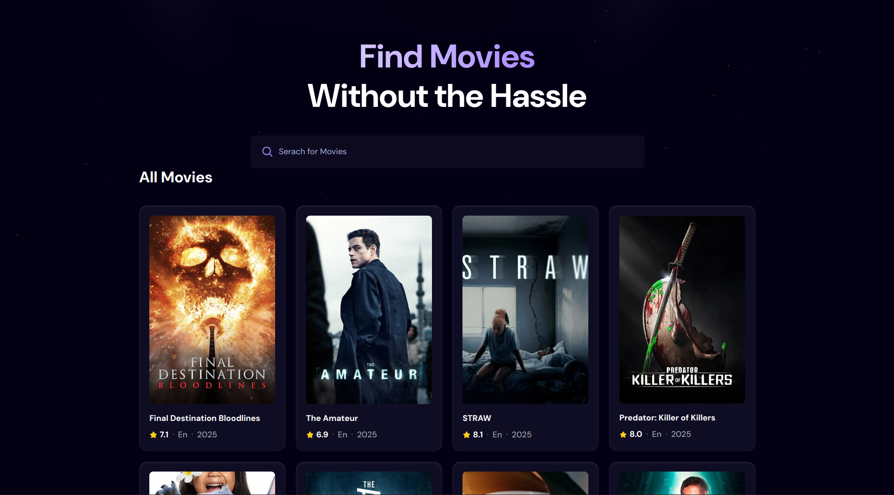
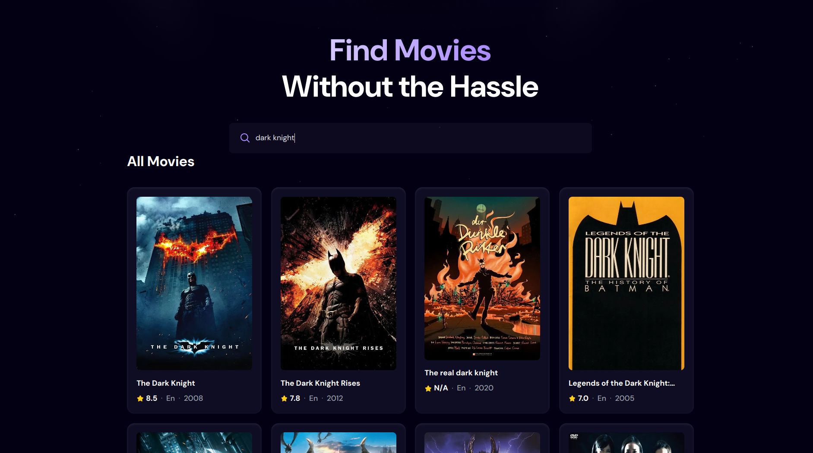

# Movie App

## Sample View

### Home

### Search

# 🚀 Overview

This is a modern and responsive movie application built with React, styled efficiently with Tailwind CSS, and powered by Vite. It features a debounced search functionality for a smooth user experience, fetching comprehensive movie data from The Movie Database (TMDB) API.

# ✨ Features

- Comprehensive Movie Search: Easily find movies with a search bar.

- Debounced Search: Implements debouncing for search input, optimizing API calls and providing a smoother, more responsive search experience.

- Responsive UI with Tailwind CSS: A clean, modern, and fully responsive user interface built with the utility-first CSS framework, Tailwind CSS, ensuring a great experience on all devices.

- TMDB API Integration: Fetches up-to-date movie information, including titles, posters, overviews, ratings, and more, directly from The Movie Database.